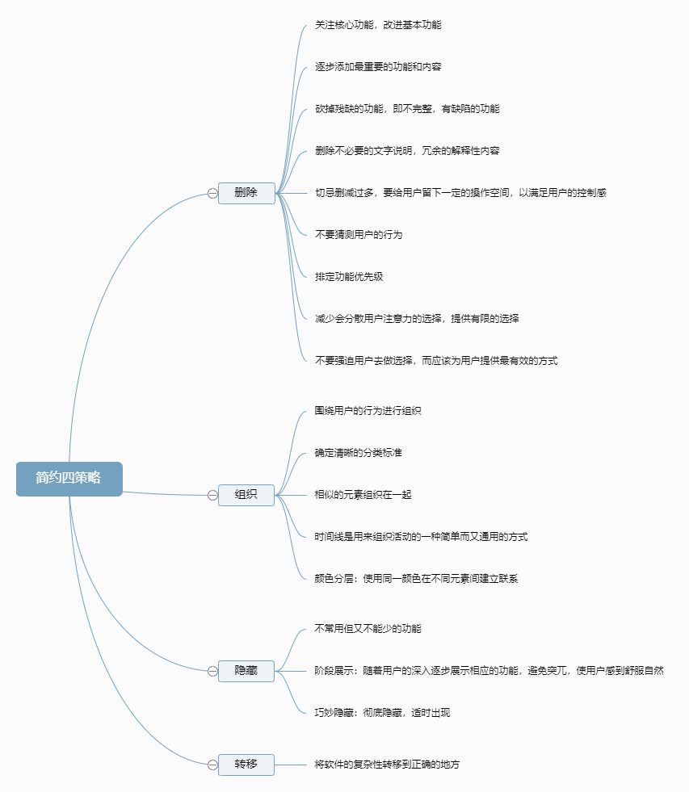

# 简约至上

> 简单的设计应能够为用户留下足够的想象空间，让用户发挥自己的创造力，避免用户对产品功能产生困惑。如，用户阅读旅游手册时，用户会不由自主地想象置身在度假地的美好感觉。简而言之，应当使用户使用产品时感到轻松自然。

## 简约四策略

⭐ 删除

> 核心在于删除那些会分散注意力的因素，聚焦于项目

⭐ 组织

> 功能分块

⭐ 隐藏

> 隐藏非核心功能。如一些软件中的扩展功能就是采用了隐藏策略

⭐ 转移

> 转移复杂性。如让用户填写结构化的表单会给用户带来糟糕的体验，应能使用户任意的输入数据，不要让用户有束缚感，而计算机负责对用户输入的数据进行结构化处理，即将复杂性转移到开发上，以增强用户的体验。

### 思维脑图

